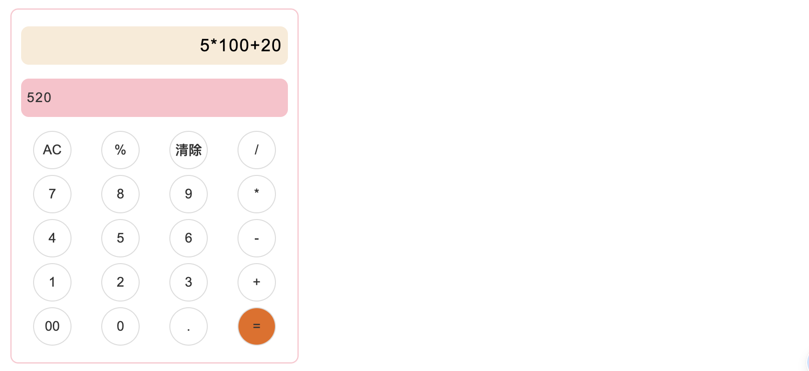

#### 作用
- github: https://github.com/nefu-xun/simple-computer
- 用于实现简单的四则运算
- 支持 +(加) -（减） *（乘） /（除） %（百分号） .（小数点）
- 包含对表达式合法性的检测、友好的提示、统一的错误处理
- 支持自定义数据精度(默认保留到小数点后14位)

#### 使用
- 传入待计算的表达式字符串即可获取结果，操作简单～ 🎉


#### 示例
```js
import Computer from 'simple-computer';

const computer = new Computer();
const strExpression = '.1+2*3%-4/2-6';
const res = computer.compute(strExpression);

if (res.error) {
  // 对于错误的表达式
  console.log(res.error.message);
} else {
  console.log(res.result);
}
````